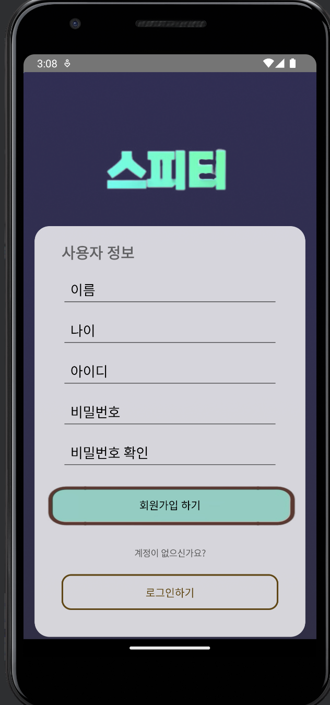
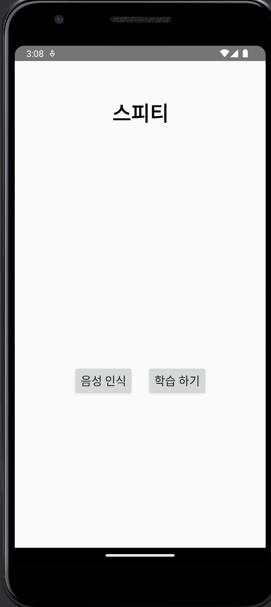
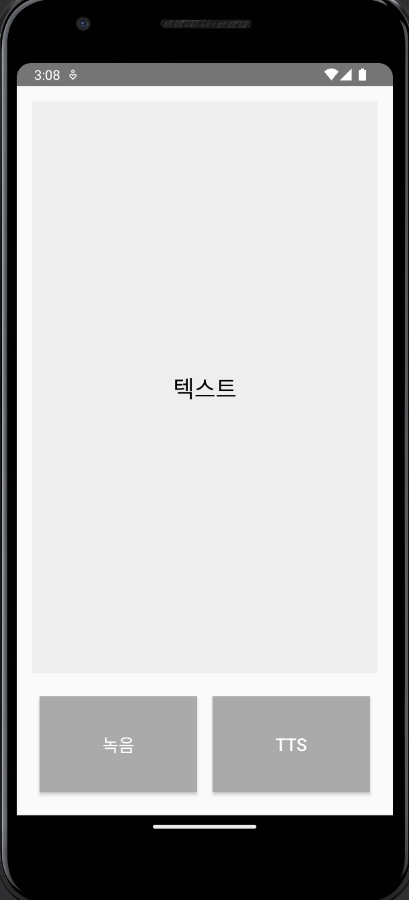
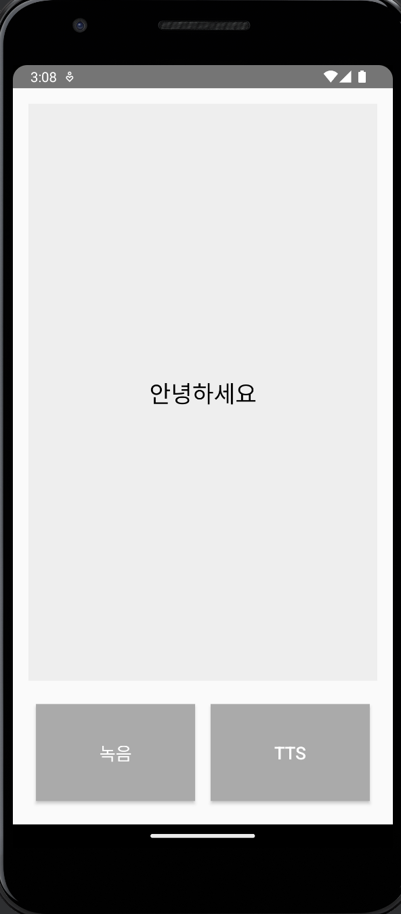

# PROGMATISM Project

---

## **1. 회원가입 (RegisterActivity)**


- 사용자 정보를 입력하여 회원가입 기능 수행

### 구성
- **이메일, 비밀번호 등 사용자 정보 입력 필드**: 사용자의 이메일, 비밀번호 등 사용자 정보를 입력 (구현 완료)
- **회원가입 버튼**: 입력된 정보로 Firebase DB에 사용자 정보 저장 (구현 완료)

### 기능 추가 예정
- **(기능 제목)**: (기능 세부 설명)

---

## **2. 로그인 (LoginActivity)**

- 가입된 사용자 정보를 바탕으로 로그인 기능 수행

### 구성
- **이메일 입력 필드** (구현 완료 -> 회원가입 이메일 입력 필드 공유)
- **비밀번호 입력 필드** (구현 완료 -> 회원가입 비밀번호 입력 필드 공유)

### 기능 추가 예정
- **로그인 버튼**: 클릭 시 Firebase Authentication을 사용해 사용자 인증을 시도 (담당: )

---

## **3. 홈 (HomeActivity)**

- 상단에 "스피티"라는 로고 위치. 그 아래에 음성 인식 버튼과 학습하기 버튼을 통해 해당 페이지로 이동

### 구성
- **음성 인식 버튼**: 음성 인식 기능을 제공하는 화면으로 이동 (구현 완료)
- **학습하기 버튼**: 학습 기능을 제공하는 화면으로 이동 (구현 완료)

### 기능 추가 예정
- **(기능 제목)**: (기능 세부 설명)

---

## **4. 음성 인식 (SpeechActivity)**



- 사용자의 음성을 인식하여 텍스트로 표시 및 TTS 기능

### 구성
- **모의 텍스트 인식 결과 표시 영역**: 사용자 음성 녹음 3초 후 인식 결과를 텍스트로 표시 (구현 완료)
- **모의 녹음 버튼**: 버튼 클릭 시 "녹음 중..." 메시지를 출력 (구현 완료)
- **모의 TTS 버튼**: 버튼 클릭 시 아직 구현되지 않은 TTS 기능에 대한 알림 메시지 출력 (구현 완료)

### 기능 추가 예정
- **음성 인식**: 녹음 버튼 클릭 시 힉습된 모델을 통해 음성 인식을 실행하고, 결과를 텍스트로 표시 (담당: 김미르)
- **TTS (Text-to-Speech)**: TTS 기능을 추가하여 인식된 텍스트를 음성으로 변환 (담당: 김미르)

---

## **5. 음성 학습 (LearningActivity)**
- 사용자 음성 모델 학습을 위한 낱말 카드 표시 및 사용자 음성 녹음 기능 수행

### 구성
- **(기능 제목)**: (기능 세부 설명)

### 기능 추가 예정
- **기본 UI구현**: 기본 화면 구성 (담당: )
- **낱말 카드**: 사용자의 음성을 학습(녹음)할 수 있는 낱말 카드 표시 (담당: )
- **이전/다음 버튼**: 클릭 시, 이전/다음 낱말 카드 표시 (담당: )
- **녹음 버튼**: 클릭 시, 사용자의 음성을 녹음하여 모델 학습에 이용 (담당: )

---
```bash
